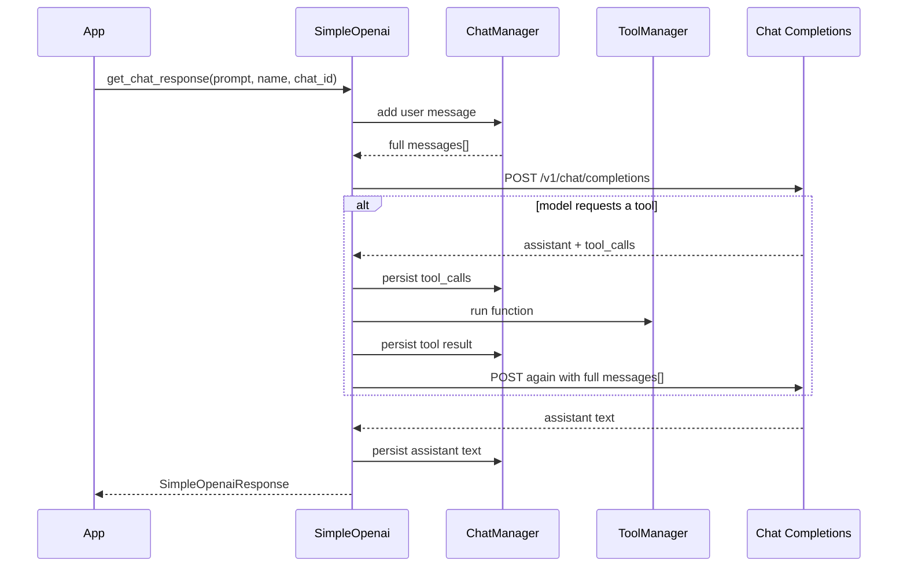
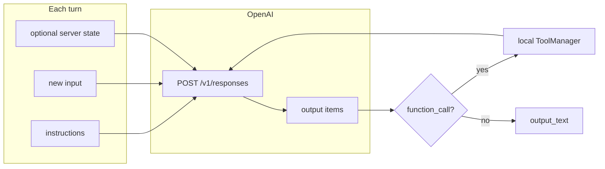
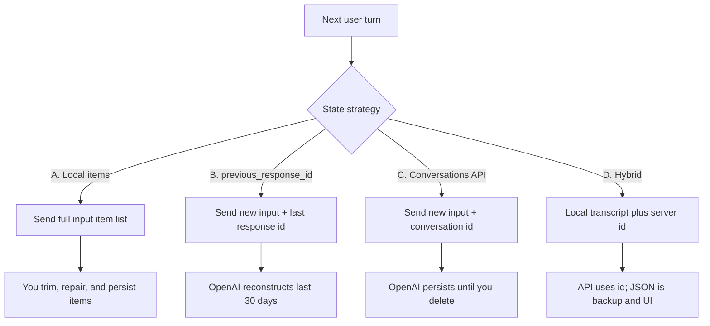
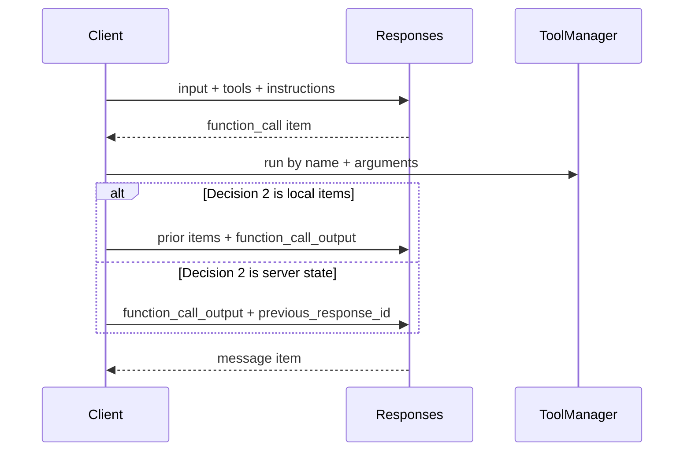
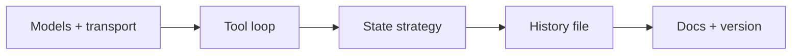
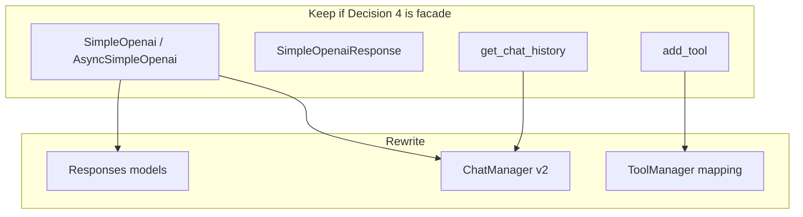

# Design: migrate Chat Completions to the Responses API

This document is a decision record for moving `simple-openai` from
`POST /v1/chat/completions` to `POST /v1/responses`.

**Status: implemented in 6.0.** Chat Completions is no longer used. The
questionnaire below is the original options list. What shipped is in
[Outcome](#outcome).

## Outcome

Shipped as Responses-only in 6.0, then tuned in the
[gpt-5.6-sol design](tune-gpt-5.6-sol.md).

1. **Migrate.** Completions is unsupported. Same public class names.
2. **State: Option A.** Local Responses item list only. `store` is `false`.
   No `previous_response_id` or Conversations API.
3. **Disk.** `chat_history.json` is a per-`chat_id` deque of Responses
   items (max 21). Older Completions files are converted on load.
4. **Public API.** `system_message` maps to `instructions` and is resent
   every turn. The speaker `name` is local metadata (`speaker`) and is
   folded into user text as `"{name}: {prompt}"` for the API.
5. **Tools.** Local `ToolManager` functions only. `strict` is `false`.
   The local `max_tool_calls` loop is kept.
6. **Images.** `get_image_url` stays on `/v1/images/generations`.
7. **Rollout.** Major version 6.0, no dual-transport flag. Unit tests with
   fixtures; no required live tests.

Defaults that followed later: model `gpt-5.6-sol`, `reasoning.effort: low`,
`max_output_tokens: 4096`, date/time on the user message, usage logging.
Group chats remain one local history per `chat_id`. `clear_chat` only
clears local history.

## Why this existed

Before 6.0 the library was a thin wrapper around Chat Completions:

- `SimpleOpenai` / `AsyncSimpleOpenai` sent a full `messages` array every turn.
- `ChatManager` stored that array per `chat_id` in `chat_history.json`, capped
  it at 21 messages, and prepended the system prompt.
- `ToolManager` ran local Python functions and wrote `role: tool` results
  back into that history.
- `get_image_url` was a separate call to `/v1/images/generations` (DALL·E 3).

Chat Completions was still supported. Responses is the current OpenAI surface
for new agent and tool work. The tool-call history bug showed why Completions
is brittle: an unanswered `tool_calls` message poisons every later turn.
Responses can take some of that bookkeeping, but it is not a drop-in swap.

## Current Completions flow (pre-6.0)



Every request is stateless. If `ChatManager` does not send a valid transcript,
the API rejects the call.

## Target Responses flow (conceptual)



The standing prompt becomes `instructions`. The user line becomes `input`.
Server state is optional: a previous response id, a conversation id, or
nothing (you resend items yourself).

## Goals

- Keep the public facade usable: `get_chat_response`, `add_tool`,
  `get_chat_history`, `chat_id`.
- Stop depending on a perfectly formed Completions `messages` array for tool
  turns.
- Choose an explicit policy for conversation state, not an accidental one.
- Keep a human-readable transcript for group chats (Botto).

## Non-goals (unless you tick them later)

- Rewriting callers to the official `openai` SDK.
- Streaming.
- Replacing local tools with only OpenAI hosted tools.
- A full Assistants-API-style thread UI.

---

## Decision 1 — Do we migrate?

Completions and Responses are different products that happen to chat.

| | Stay on Completions | Move to Responses |
|---|---|---|
| **Pros** | No rewrite. Current models and tests keep working. History format stays yours. | Current API. Better tool-call items. Optional server state. Built-in tools if we want them later. |
| **Cons** | We keep owning `messages` validity forever. Types drift (`strict`, `developer`, reasoning). | New models, new item types, new failure modes. Callers may need a major version. |

- [ ] Stay on Completions. Only refresh request/response types.
- [ ] Migrate the wrapper to Responses. Completions becomes unsupported.
- [ ] Support both for one major version, then drop Completions.

---

## Decision 2 — Who holds conversation state?

This is the important choice. It decides whether `ChatManager` still builds
the model context or only a display log.



### Option A — Keep rolling our own (Responses, no server chain)

Send previous output items plus the new user item on every call. Same job as
today, different JSON.

| Pros | Cons |
|---|---|
| Works with `store: false`. | We still own pairing of `function_call` / `function_call_output`. |
| We can trim to 21 items, edit, or repair. | Request size still grows with the window. |
| No 30-day surprise. | Least “Responses-native”. |
| History file remains the source of truth. | |

- [ ] Option A. Local item list only.

### Option B — `previous_response_id`

Store the last response id per `chat_id`. Next turn sends only the new input
and that id. Resend `instructions` every time; they are not inherited.

| Pros | Cons |
|---|---|
| Small requests. No tool-transcript surgery for the API. | Stored responses expire after about **30 days**. The next call then has no memory. |
| Matches the happy-path docs. | Still billed for prior tokens in the chain. |
| | Forking / editing history is awkward. |
| | Need a fallback when the id is missing or expired. |

- [ ] Option B. Chain with `previous_response_id`.

### Option C — Conversations API

Create a conversation object per `chat_id`. Later turns pass
`conversation=...`. Items are not on the 30-day response TTL.

| Pros | Cons |
|---|---|
| Durable server thread without resending the transcript. | Extra object to create, store, and delete. |
| Better for chats that go quiet for weeks. | OpenAI holds the canonical thread. |
| | Harder to cap at 21 messages ourselves. |
| | Another API to learn and test. |

- [ ] Option C. One conversation id per `chat_id`.

### Option D — Hybrid (recommended starting point if migrating)

Keep `chat_history.json` as the product transcript. Also store
`last_response_id` and/or `conversation_id` per chat. The API uses the server
id. If the id is gone, rebuild `input` from the local file.

| Pros | Cons |
|---|---|
| UI, logs, and `get_chat_history` stay local. | Two stores can drift. |
| Survives 30-day expiry and `store: false` callers. | More code than B or C alone. |
| We can still repair or trim the display log. | Must define which store wins on conflict. |

- [ ] Option D. Local transcript + server id, local file wins on rebuild.

**If you ticked B, C, or D, also pick a fallback:**

- [ ] On missing/expired id: rebuild from local history (requires a local log).
- [ ] On missing/expired id: start a new thread and lose memory.
- [ ] On missing/expired id: return an error and ask the user to `/reset`.

---

## Decision 3 — What do we store on disk?

Today: a deque of Completions `ChatMessage` objects, max 21, per `chat_id`.

| | Display-only log | Model-context log | Ids only |
|---|---|---|---|
| **Pros** | Simple. Safe to truncate. | Can rebuild API input. | Tiny file. |
| **Cons** | Cannot recover an expired server chain unless we also keep ids. | Must map Completions messages to Responses items. | `get_chat_history` dies unless we fetch from OpenAI. |

- [ ] Keep a local human transcript (name + text) for UI only.
- [ ] Keep a local Responses item list that can be resent as `input`.
- [ ] Store only `last_response_id` / `conversation_id`.
- [ ] Keep both a UI transcript and ids (pairs with Decision 2 option D).

**Existing `chat_history.json` files:**

- [ ] Best-effort convert Completions messages to Responses items.
- [ ] Keep reading the old format until the next `clear_chat`.
- [ ] Ignore old files. New format only (breaking).

---

## Decision 4 — Public API compatibility

Callers today:

```python
client = AsyncSimpleOpenai(api_key, system_message, storage_path, timezone)
client.add_tool(tool_definition, function)
result = await client.get_chat_response(prompt, name, chat_id, max_tool_calls, add_date_time)
client.get_chat_history(chat_id)
client.get_image_url(prompt, style="vivid")
```

| | Facade, same methods | New class | Breaking rewrite |
|---|---|---|---|
| **Pros** | Botto keeps compiling. | Clean Responses types. | No dual mental model. |
| **Cons** | Hidden behaviour change (`instructions`, ids, item repair). | Two clients to maintain. | Downstream churn. |

- [ ] Keep `SimpleOpenai` / `AsyncSimpleOpenai` method names. Change the transport underneath.
- [ ] Add `SimpleOpenaiResponses` / `AsyncSimpleOpenaiResponses`. Leave Completions classes alone.
- [ ] Breaking 6.0: Responses only, same class names, document the deltas.

**`system_message` constructor arg:**

- [ ] Map it to Responses `instructions` and resend every turn.
- [ ] Rename the arg to `instructions` (breaking).
- [ ] Support both names for one version.

**`name` on user messages (Stephen / Tim / Dean):**

Responses input items can carry a name. Completions used `ChatMessage.name`.

- [ ] Keep sending `name` on user input items.
- [ ] Fold the name into the text (`Stephen: ...`) and stop sending `name`.

---

## Decision 5 — Tools

Today we only host local functions. The model may call them; we execute and
return a string. Completions requires a `tool` message for every
`tool_call_id`. Responses uses `function_call` and `function_call_output`
items with `call_id`.



| | Local functions only | Local + OpenAI hosted tools | Hosted tools only |
|---|---|---|---|
| **Pros** | Same `add_tool` contract. | Web search etc. without our code. | Least glue. |
| **Cons** | We still write outputs. | Two tool kinds, more tests. | Breaks `query_football` / custom tools. |

- [ ] Keep local `ToolManager` functions only. Map to Responses function tools.
- [ ] Local functions plus optional hosted tools (`web_search`, image, …).
- [ ] Hosted tools only (breaking).

**Schema / strict mode:**

- [ ] Add `strict: true` on function tools (schemas must list every property
      in `required` and set `additionalProperties: false`).
- [ ] Leave `strict` off / unset (current Completions behaviour).
- [ ] Make `strict` opt-in per tool.

**`max_tool_calls`:**

- [ ] Keep the local loop and cap (current `max_tool_calls`).
- [ ] Use the Responses tool-loop limit if we adopt one, and drop our counter.

---

## Decision 6 — Images

`get_image_url` is independent of chat today.

| | Keep `/v1/images/generations` | Responses image tool | New GPT Image models on Images API |
|---|---|---|---|
| **Pros** | No chat coupling. `style=vivid` still works on DALL·E 3. | One API family. | Current image quality. |
| **Cons** | DALL·E 3 is the old default. | Image gens land in the chat thread. | GPT Image returns `b64_json`, not a URL; no `style`. |

- [ ] Leave `get_image_url` on `/v1/images/generations` for this migration.
- [ ] Move image generation into Responses as a tool on the same chat.
- [ ] Switch the Images API model to `gpt-image-1.5` / `gpt-image-2` and return
      base64 (breaking for URL callers).

---

## Decision 7 — Rollout



| | Big bang in one release | Phased behind a flag | New package version only |
|---|---|---|---|
| **Pros** | One story to tell. | Botto can switch per chat. | PyPI semver is honest. |
| **Cons** | High blast radius. | Two paths in one process. | Users pin and lag. |

- [ ] One release, Responses only.
- [ ] Constructor flag `api="completions" | "responses"`, default completions,
      flip the default later.
- [ ] Major version bump (6.0) with a changelog and no flag.

**Testing bar:**

- [ ] Unit tests for item mapping, tool output pairing, and expired-id fallback.
- [ ] One live integration test (needs an API key; keep it opt-in).
- [ ] No live tests; recorded fixtures only.

---

## Suggested default (not ticked)

If you want a bias to argue against rather than a blank page:

1. Migrate; do not keep Completions forever.
2. Hybrid state (local UI transcript + `previous_response_id`, rebuild from
   disk after expiry).
3. Same public method names; `system_message` → `instructions` internally.
4. Local tools only, with `strict` opt-in.
5. Images stay on the Images API for now.
6. Major version 6.0, no dual-transport flag.

Tick the sections above if you agree; ignore this list if you do not.

---

## Implications for this repo

Regardless of ticks, a Responses migration touches:

| Area | Likely change |
|---|---|
| `constants.py` | Add `/v1/responses`. Completions URL becomes legacy or dies. |
| `open_ai_models.py` | New request (`model`, `input`, `instructions`, `tools`, `previous_response_id`, `conversation`, `store`). New output items. Looser response parsing. |
| `chat_manager.py` | Either store items + ids, or become display-only. Old Completions repair logic is replaced by `function_call` / `function_call_output` pairing. |
| `tool_manager.py` | Keep execution; change the JSON we attach to the next request. |
| `simple_openai.py` / `async_simple_openai.py` | New POST body and tool loop. Stop reading `choices[0].message`. |
| Docs / README | `add_function` / `function` role text is already wrong; fix it in the same pass. |



## Open questions after you tick

Write answers here once the boxes are chosen:

- Default model id for Responses (today Completions defaults to `gpt-5.5`):
  `gpt-5.6-sol`
- `store` default (`true` is required for `previous_response_id` chaining):
  `false`
- Do group chats share one conversation id or one per `chat_id`? (today: per `chat_id`)
  Per `chat_id`, local only
- Retention / deletion when someone calls `clear_chat` — delete the OpenAI
  conversation too?
  Local only; nothing is stored at OpenAI
- Timezone / `add_date_time`: still prefix `instructions`, or a hidden
  context item?
  Prefix the latest user message so `instructions` stay cacheable

## Decision summary

Copy this block into a PR or issue when filled in:

```text
1. Migrate:            Responses only
2. State:              A (local items, store: false)
   Fallback:           n/a
3. Disk:               Responses item list as model context
   Old files:          convert Completions messages on load
4. Public API:         same class and method names
   instructions:       system_message mapped internally
   user name:          fold into text; speaker is local
5. Tools:              local ToolManager only
   strict:             false
   max_tool_calls:     keep local loop
6. Images:             /v1/images/generations
7. Rollout:            6.0, no dual-transport flag
   Tests:              unit tests / fixtures
```
