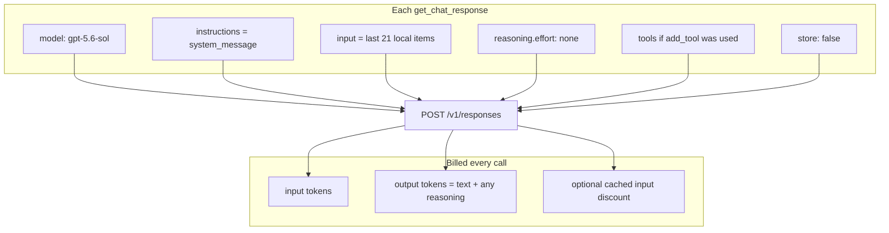
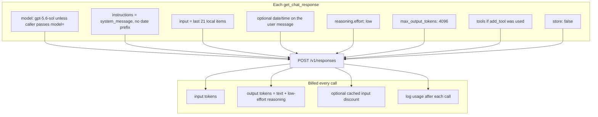
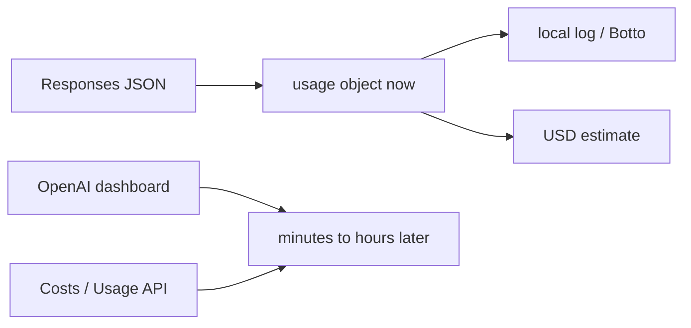

# Design: tune gpt-5.6-sol for quality and cost

This document is a decision record for the knobs that change how
`gpt-5.6-sol` behaves in `simple-openai`, and what that does to replies,
latency, and spend.

Decisions below are **agreed** and implemented. The “today” section is the
v6.1.0 baseline this work replaced.

Prices below are OpenAI’s published **gpt-5.6-sol** rates as of 20 Sep 2026
(promotional pricing at least through 21 Nov 2026). They are per million
tokens. Reasoning tokens are billed as **output**.


|                              | Short context (≤272K input) | Long context (>272K input) |
| ---------------------------- | --------------------------- | -------------------------- |
| Input                        | $4.00                       | $8.00                      |
| Cached input                 | $0.40                       | $0.80                      |
| Cache writes                 | $5.00                       | $10.00                     |
| Output (visible + reasoning) | $20.00                      | $30.00                     |


## Why this exists

v6.1.0 already does three cost-relevant things:

- `store: false` (local `chat_history.json`, nothing retained by OpenAI).
- `reasoning.effort: none`.
- Reasoning items are pruned and never resent.

The library still hard-codes almost everything else. The ticks in this
document are the next defaults: Sol stays the default model but callers
can override it; effort moves to `low`; output is capped at 4096; date
and time move onto the user message so `instructions` stay cacheable;
`usage` is logged. History, tool-loop cap, verbosity, and prompt-cache
key stay as they are.

## What the library sends today




Not sent today: `reasoning.mode`, `text.verbosity`, `max_output_tokens`,
`prompt_cache_key`, `temperature`.

`temperature` is rejected on this model. Do not add it.

`get_chat_response(..., add_date_time=True)` prepends a fresh timestamp to
`instructions`. That is cheap in tokens and expensive in cache: the prefix
changes every call, so prompt-cache hits drop.

`SimpleOpenaiResponse` only returns `success` and `message`. The API’s
`usage` object is in the JSON today (`ResponsesResult` allows extra fields)
and is then thrown away.

## What we will send (agreed)



Still omitted: `reasoning.mode` (`standard`), `text.verbosity` (API
`medium`), `prompt_cache_key`. `temperature` stays off.

Reasoning **items** stay pruned from local history. Effort `low` means
the model may think on each call; those tokens are billed as output and
are **not** stored or replayed.

## Rough cost of one turn

Numbers are order-of-magnitude for a group-chat turn, not a quote.


| Piece                                    | Typical tokens                 | Rate                            | Cost                      |
| ---------------------------------------- | ------------------------------ | ------------------------------- | ------------------------- |
| Instructions + tools + ~21 history items | 2,000–8,000 input              | $4 / MTok                       | $0.008–$0.032             |
| Same input if 80% cached                 |                                | $0.40 / MTok on the cached part | ~10× cheaper on that part |
| Visible reply                            | 50–400 output                  | $20 / MTok                      | $0.001–$0.008             |
| Reasoning at `low` (agreed)              | hundreds–low thousands extra   | $20 / MTok                      | typically well under $0.04 |
| Each extra tool round                    | Full input again + more output | same                            | another turn              |


Moving from `none` to `low` is the largest expected cost jump in this
plan. Growing history is next. Switching down the model family (`terra` /
`luna`) is available per caller (Decision 1) if a chat does not need Sol.

---

## Decision 1 — Model

`gpt-5.6-sol` is the flagship. Same family, cheaper IDs:


|               | `gpt-5.6-luna`   | `gpt-5.6-terra` | `gpt-5.6-sol` (current) |
| ------------- | ---------------- | --------------- | ----------------------- |
| Input / MTok  | $0.20            | $2.00           | $4.00                   |
| Output / MTok | $1.20            | $12.00          | $20.00                  |
| Effect        | Fastest, weakest | Middle          | Best quality            |
| Tools         | Yes              | Yes             | Yes                     |


- [ ] Keep `gpt-5.6-sol`.
- [ ] Switch default to `gpt-5.6-terra`.
- [ ] Switch default to `gpt-5.6-luna`.
- [x] Keep Sol as default, let the caller pass `model=` per client or per call.

---

## Decision 2 — `reasoning.effort`

Controls how many hidden thinking tokens are generated **before** the
visible answer. Those tokens are billed as output. Current: `none`.


| Effort                   | Replies                                                                    | Latency         | Cost               |
| ------------------------ | -------------------------------------------------------------------------- | --------------- | ------------------ |
| `none` (current)         | Chat Completions-like. Tools still work. Weakest on hard multi-step tools. | Lowest          | Lowest             |
| `low`                    | Better tool planning and “think then answer”.                              | Modest increase | Modest increase    |
| `medium`                 | Model default if we omitted the field. Stronger judgement.                 | Noticeable      | Often the big bill |
| `high` / `xhigh` / `max` | Hard reasoning. Wrong for Botto banter.                                    | High            | High               |


OpenAI’s own chat-assistant note for this family is: try `low` if `none`
feels thin; do not jump to `medium` unless evals show it is worth it.

- [ ] Keep `none`.
- [x] Change to `low`.
- [ ] Change to `medium`.
- [ ] Caller-settable (`none` / `low` / `medium` only).

---

## Decision 3 — `reasoning.mode`

Independent of effort. `standard` is the default (current, because omitted).
`pro` runs more model work for the same effort and bills those extra tokens
at Sol’s normal rates. Higher quality, higher cost and latency.

- [x] Keep `standard` (omit the field).
- [ ] Set `pro`.
- [ ] Caller-settable.

---

## Decision 4 — `text.verbosity`

Does **not** change reasoning. It changes how long the visible answer is
(`low` / `medium` / `high`). Shorter answers: fewer output tokens, snappier
group-chat. Too low: clipped jokes and missing steps in tool summaries.

Current: unset (API default, `medium`).

- [x] Leave unset (API default).
- [ ] Set `low`.
- [ ] Set `medium` explicitly.
- [ ] Set `high`.
- [ ] Caller-settable.

---

## Decision 5 — `max_output_tokens`

Hard cap on **visible output + reasoning + tool-call JSON** for **one**
Responses HTTP call. It does not cap input. It does not cap the football
API payload (that is input on the next round). With `max_tool_calls=1`
you pay this cap at most twice per user message (first call, then the
follow-up after the tool).

Effort is **`low`** (Decision 2). The cap is a shared budget: hidden
thinking is drawn first, then whatever is left can become the
WhatsApp-visible reply. OpenAI’s 25,000-token “reserve” is for high
effort / research, not this chat.

English rule of thumb: **100 tokens ≈ 75 words ≈ 4–8 group-chat lines.**


| Cap   | If all of it were visible text | With `effort: low` in practice                                                                                                                                        | Worst-case output $ (Sol, this call only) | Risk                                   |
| ----- | ------------------------------ | --------------------------------------------------------------------------------------------------------------------------------------------------------------------- | ----------------------------------------- | -------------------------------------- |
| Unset | Up to 128K                     | No safety brake                                                                                                                                                       | Unbounded                                 | A stuck/verbose turn can get expensive |
| 512   | ~400 words                     | Often too tight. Low reasoning can eat most of 512; you get a clipped line or `incomplete` with **no visible text**. You still pay for input + whatever thinking ran. | $0.010                                    | High for Botto + tools                 |
| 1024  | ~750 words                     | Fine for a short joke. Tight for “summarise today’s scores”. Some tool summaries will truncate.                                                                       | $0.020                                    | Medium                                 |
| 2048  | ~1,500 words                   | Comfortable for low-effort chat **and** a long fixture list summary. Hits should be rare.                                                                             | $0.041                                    | Low                                    |
| 4096  | ~3,000 words                   | Almost never binds in group chat. Insurance policy only.                                                                                                              | $0.082                                    | Very low                               |


This library today treats HTTP 200 as success. If the model hits the cap
before any `output_text`, Botto would show **“No response”** and you
would still have been billed. **4096** is insurance: group chat should
almost never bind, worst-case output on this call is about **$0.08**.

`text.verbosity` stays at the API default (`medium`, Decision 4) and
spends the **same** budget as reasoning.

Input history (Decision 6 = 21) is **not** affected by this cap.

- [ ] Leave unset.
- [ ] Cap at 512 (short chat).
- [ ] Cap at 1024.
- [ ] Cap at 2048.
- [x] Cap at 4096.
- [ ] Caller-settable with a library default of: _____

---

## Decision 6 — Local history window

`MAX_CHAT_HISTORY` is 21 **items** (user, assistant, function_call,
function_call_output). Reasoning items are already dropped.

Larger window: better “what did we say earlier?”, more input tokens every
turn. Smaller window: cheaper, more amnesia.

Prompt cache likes a **stable prefix**. A rolling deque that drops the
oldest message every turn reduces cache hits on the tail; the system
`instructions` and tool schemas still cache if they do not change.

- [x] Keep 21.
- [ ] Reduce to 12.
- [ ] Reduce to 8.
- [ ] Increase to 40.
- [ ] Caller-settable `max_messages` (already on `ChatManager`; expose on the client).

---

## Decision 7 — Date/time in instructions

`add_date_time=True` (Botto uses this for “what day is it?”) rewrites
`instructions` every call. That is a few dozen tokens and it **breaks
prompt cache** on the most expensive prefix (system prompt + tools).

Cached input is 10% of uncached input ($0.40 vs $4.00 / MTok).

- [ ] Keep current behaviour (caller chooses `add_date_time` per call).
- [x] Put date/time in the **user** message instead of `instructions`, so the system prefix stays cacheable.
- [ ] Stop sending date/time entirely; only answer time questions via a tool.

---

## Decision 8 — Tools and tool-loop cap

Each tool round is another full Responses request with the whole local
`input`. `max_tool_calls` defaults to **1**. `parallel_tool_calls` is
`false`.

More rounds: better multi-step tools, linear extra cost. Parallel calls:
one round, several functions; slightly more output, fewer round trips.

- [x] Keep `max_tool_calls=1`, `parallel_tool_calls=false`.
- [ ] Raise default `max_tool_calls` to 3.
- [ ] Allow `parallel_tool_calls=true`.
- [ ] Leave defaults; only document that callers should keep the cap low.

---

## Decision 9 — Prompt cache

With `store: false` you still get automatic prefix caching when the leading
tokens match a recent request.

`prompt_cache_key` (stable string, e.g. `botto-{chat_id}`) can improve hit
rate. `prompt_cache_options` exists for gpt-5.6+; default implicit
breakpoint is usually enough.

Hits require: same model, same `instructions`, same tools, same leading
`input`. Changing effort/verbosity/model invalidates the cache.

- [x] Do nothing (rely on implicit cache).
- [ ] Set `prompt_cache_key` per `chat_id`.
- [ ] Also keep `instructions` and tools byte-stable (pairs with Decision 7).

Decision 7 still makes the implicit cache work better: `instructions`
stop changing every call. No extra `prompt_cache_key` field.

---

## Decision 10 — Realtime cost monitoring

The platform usage dashboard and the organization Costs / Completions
Usage APIs (`/v1/organization/costs`, `/v1/organization/usage/completions`)
are **aggregated and delayed**. They will not show the last few minutes.
That is why they feel stale. They are fine for daily totals, not for “what
did this chat just cost?”.

The live source is the `usage` **object on each Responses body**. It is
returned with the completion, before any dashboard update:

```json
"usage": {
  "input_tokens": 75,
  "input_tokens_details": { "cached_tokens": 0 },
  "output_tokens": 1186,
  "output_tokens_details": { "reasoning_tokens": 1024 },
  "total_tokens": 1261
}
```

Estimated USD for a call (short-context Sol):

```text
uncached_input = input_tokens - cached_tokens
cost =
  uncached_input * 4.00  / 1e6
  + cached_tokens  * 0.40 / 1e6
  + output_tokens  * 20.00 / 1e6
```

`output_tokens` already includes `reasoning_tokens`. Do not add reasoning
again.

This library currently ignores `usage`. That is the gap. There is no
separate “realtime billing API” that is faster than this object.

Project **budget limits / monthly spend caps** in the OpenAI dashboard can
hard-stop runaway spend. They are not a live display.




- [ ] Do nothing. Keep using the dashboard.
- [x] Parse `usage` and log it (print or logger) on each chat call.
- [ ] Add `input_tokens`, `output_tokens`, `reasoning_tokens`, `cached_tokens`, and `estimated_cost_usd` on `SimpleOpenaiResponse`.
- [ ] Keep a running per-`chat_id` total in the process (and optionally on disk).
- [ ] Also poll the organization Costs API for daily reconciliation (not realtime).

**Testing bar for monitoring:**

- [x] Unit test: parse a fixture `usage` object and compute the USD estimate.
- [x] No live spend tests.

---

## Things this document will not change

- `store: false` and local history (already decided).
- DALL·E 3 `get_image_url` (separate Images API; not Sol tokens).
- `temperature` / `top_p` (not valid on gpt-5.6-sol).

---

## Agreed configuration

1. Default model stays `gpt-5.6-sol`. Callers can pass `model=` on the
   client and on `get_chat_response`.
2. `reasoning.effort: low`. Keep pruning reasoning items from history.
3. Omit `reasoning.mode` (`standard`).
4. Omit `text.verbosity` (API default `medium`).
5. `max_output_tokens: 4096`.
6. History window stays 21 items.
7. When `add_date_time=True`, put the timestamp on the **user** message,
   not on `instructions`.
8. Keep `max_tool_calls=1` and `parallel_tool_calls=false`.
9. No `prompt_cache_key`. Implicit prefix cache only (helped by 7).
10. Parse `usage` and log it on each chat call. Do **not** add usage
    fields to `SimpleOpenaiResponse`. No per-chat running total. No
    Costs API poll.

Unit tests parse a fixture `usage` object and compute the USD estimate.
There are no live spend tests.

## Implementation notes

- Constructor and `get_chat_response` gain an optional `model: str`.
  Per-call overrides the client default; client default overrides
  `gpt-5.6-sol`.
- `ReasoningConfig.effort` default becomes `low`.
- `ResponsesRequest` sends `max_output_tokens=4096`.
- Date/time prefix moves from `instructions` to the user `InputItem`.
- After a successful Responses body, log `input_tokens`,
  `cached_tokens`, `output_tokens`, `reasoning_tokens`, and an estimated
  USD figure using the short-context Sol rates above. Tool-loop follow-up
  calls log separately.
- Public facade otherwise unchanged: `get_chat_response`, `add_tool`,
  `get_chat_history`, `chat_id`.

---

## Decision summary

```text
1. Model:              gpt-5.6-sol default; caller may pass model=
2. reasoning.effort:   low
3. reasoning.mode:     standard (omit)
4. verbosity:          unset (API medium)
5. max_output_tokens:  4096
6. History window:     21
7. Date/time:          on the user message, not instructions
8. Tools:              max_tool_calls=1, parallel_tool_calls=false
9. Prompt cache:       implicit only
10. Cost monitoring:   parse usage and log each call
    Tests:             unit-test usage parse and USD estimate; no live spend
```

